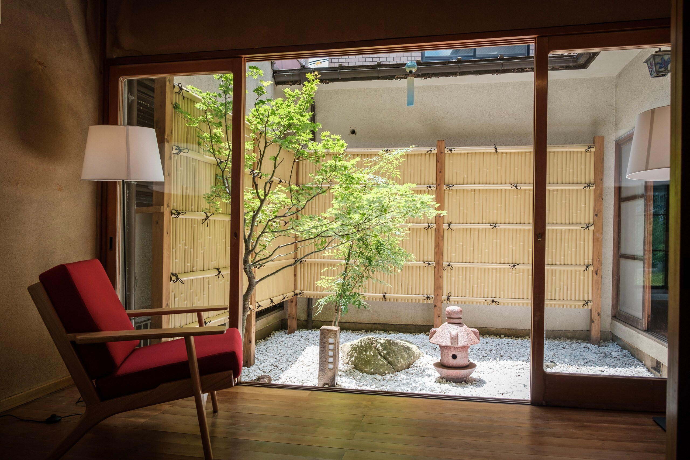
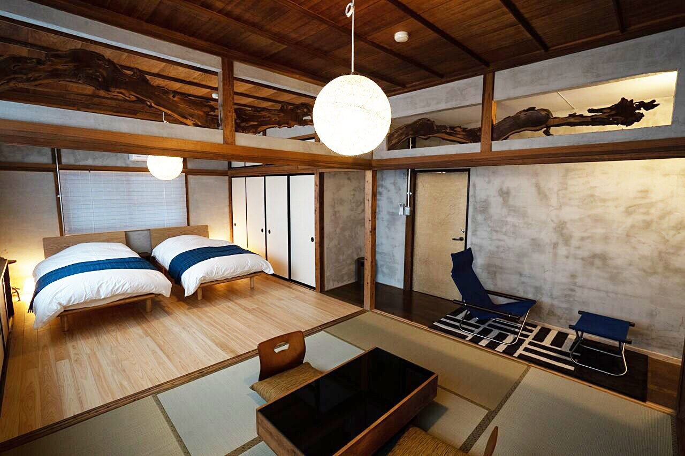
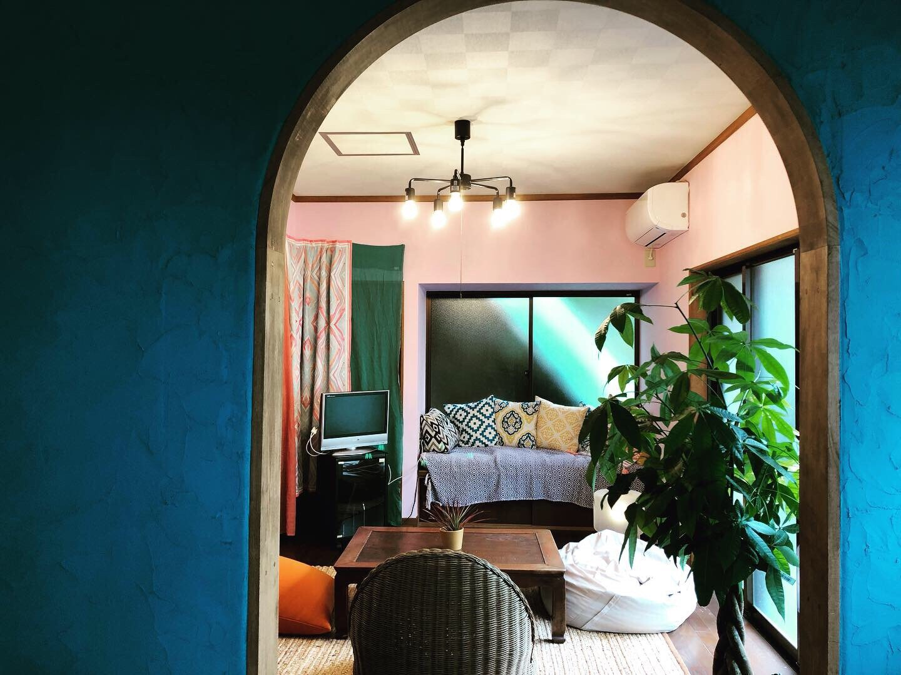
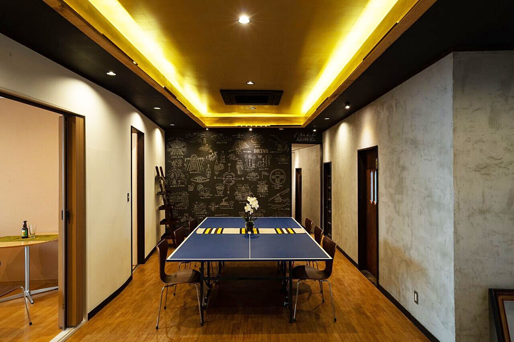

# 第0回CREATE合宿！！

この度CREATEで合宿を行うようになりました👏

エンジニアは0から数えるということで0回から始まります！

なお、この合宿のしおりは逐次アップデートされていきますので、楽しみにしてお待ちください😎

## 合宿情報
- 日時：2020年03月20日〜21日（１泊２日）
- 場所：埼玉県秩父市周辺（参加人数によって確定させるので詳細はまだ決まっておりません）
- 費用：10,000〜15,000円（まだ確定でないので変動しますが、15,000円を超えることはないです。）
- 集合時間：午前9時
- 集合場所：池袋駅
  - 池袋→西武秩父駅（約60分）片道1100円

## 開催目的
- プログラミングスキルを向上させる
- 普段扱えないようなテーマで深みのある技術を学ぶ
- 技術以外の部分で魅力的な人間になる
- 横のつながりを作ることで成長しやすい環境を自ら構築する

## 合宿の流れ

流れに関してもざっくりとなので変更あるかもです😅

### 1日目

- 09:00 オリエンテーション
- 11:00 チームで使うGit勉強会
- 13:00 お昼ご飯
- 15:00 自分を見つめ直すレクリエーション
- 19:00 夜ご飯
- 21:00 フリータイム

### 2日目

- ~9:00 フリータイム
- 09:00 チーム開発 第一ラウンド
- 12:00 お昼ご飯
- 14:00 チーム開発 第二ラウンド
- 16:00 フリータイム
- 17:00 締め&解散

## 持ち物

- パソコン
- 電源ケーブル
- 日常品
- 成長したいと願う心

## FAQ

- キャンセルの場合
  - 2/15確定以降のキャンセルはによる返金の予定はありません。なので、日程を確定させてから応募していただけると助かります。

## 宿泊予定地

